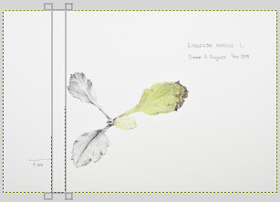

`sudo make me a white background`

* **Script installation:** The scripts can be installed by copying the .scm files into `/.gimp-2.8/scripts/` 
  in your home directory.
* **Resynthesizer installation:** On Linux, Resynthesizer is available in the package *gimp-plugin-registry* 
  on Debian based system.

## Even Background

This script generates a background layer from a selection, making it mostly white, as in the
sample images below. Note that it only works for linear vertical gradients; the next plugin
which uses Resynthesizer is much better, but also much slower.

Please see [this question on Stackexchange][SX] to understand the problem.

**Usage:** Create a selection rectangle of full image height and any width, but without any parts 
of the drawing inside, then run the script.

## Even Background with Resynthesize

This is an improved version of the previous script, and it uses the [Resynthesizer plugin]
(https://github.com/bootchk/resynthesizer) to tackle backgrounds which are unevenly lit. 
The result is usually an image with plain white background.
This script is based on [this Stack answer](http://photo.stackexchange.com/a/60048/4149).

This script requires the [Resynthesizer plugin](https://github.com/bootchk/resynthesizer). 
It can not only tackle linear backgrounds, but generally uneven ones, and was created based on 
.

**Usage:** Create a selection that covers the drawing without background, then run the plugin. 
A fast way to mask the object is:

1.  Enable Quick Mask (Shift+Q)
2.  Use the pencil tool (N) to change the mask with white/black colour
3.  Disable the Quick Mask (Shift+Q) to get a selection, then run the plugin

 

[SX]: http://photo.stackexchange.com/questions/60001/how-to-fix-uneven-gradient-lighting-on-a-canvas-with-white-background